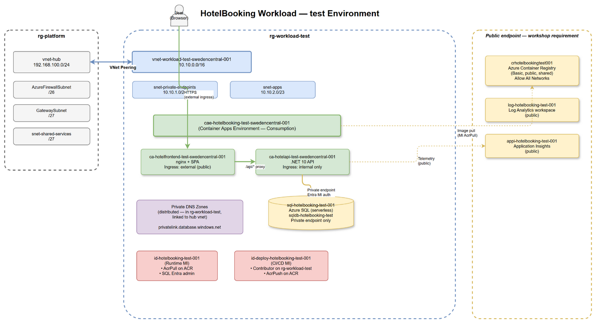

# Workload Infrastructure Design — HotelBooking (`test` environment)

> **Status:** Approved  
> **Environment:** `test`  
> **Region:** `swedencentral`  
> **Resource group:** `rg-workload-test`

## Architecture Diagram

*Source: [architecture.drawio](architecture.drawio) — open in draw.io to edit.*

---

## 1. Workload Analysis

### Backend — .NET 10 Minimal API

| Aspect | Detail |
|--------|--------|
| Runtime | .NET 10 (ASP.NET Core Minimal API) |
| Port | 8080 (default Kestrel in container) |
| Data store | Azure SQL Server via EF Core (`Microsoft.EntityFrameworkCore.SqlServer`) |
| Connection string | `ConnectionStrings:HotelDb` — expects `Authentication=Active Directory Default` for managed-identity auth |
| Telemetry | Azure Monitor OpenTelemetry (`Azure.Monitor.OpenTelemetry.AspNetCore`) — activated by `APPLICATIONINSIGHTS_CONNECTION_STRING` |
| API surface | REST: `GET /api/hotels`, `GET /api/hotels/{id}`, `GET /api/hotels/{id}/rooms`, `POST /api/bookings`, `GET /api/bookings/{id}`, `GET /api/bookings/by-email/{email}`, `DELETE /api/bookings/{id}` |
| Static files | Serves the built SPA via `UseStaticFiles()` + `MapFallbackToFile("index.html")` |
| DB init | `DbInitializer.InitializeAsync` calls `EnsureCreatedAsync` + seeds on first startup |
| Auth | None (no user authentication) |
| CORS | Open (`AllowAnyOrigin`) — unnecessary when fronted by nginx in the same container app environment |

### Frontend — React SPA (Vite 7 + Tailwind 4)

| Aspect | Detail |
|--------|--------|
| Framework | React 19, React Router 7, TypeScript |
| Build tool | Vite 7 (requires Node ≥ 20.19) |
| Output | Static HTML/JS/CSS bundle |
| API calls | All relative (`/api/*`) — expects a reverse-proxy (nginx) to route to the backend |
| Telemetry | OpenTelemetry traces via OTLP to `/otel` endpoint; optional, needs `VITE_OTEL_EXPORTER_OTLP_ENDPOINT` at build time |
| Serving | In production: nginx serves the static bundle and reverse-proxies `/api/*` to the backend container app's internal FQDN |

---

## 2. Compute — Azure Container Apps (Consumption)

### Decision

| Option considered | Verdict | Rationale |
|---|---|---|
| **Azure Container Apps (Consumption)** | **Selected** | Scale-to-zero, built-in VNet integration, managed identity support, internal + external ingress, minimal ops overhead, serverless billing. (Cost / Ops) |
| Azure App Service | Rejected | No scale-to-zero on basic tiers; per-instance billing even at idle. (Cost) |
| Azure Kubernetes Service | Rejected | Operational overhead disproportionate for a two-container workload with no custom orchestration needs. (Ops) |
| Azure Container Instances | Rejected | No built-in ingress controller, no managed revisions, no scale-to-zero without orchestration. (Ops / Reliability) |

### Container Apps Environment

| Property | Value | Rationale |
|---|---|---|
| Name | `cae-hotelbooking-test-swedencentral-001` | CAF naming |
| Workload profile | Consumption (serverless) | Scale-to-zero, pay-per-use (Cost) |
| VNet integration | `snet-apps` (10.10.2.0/23) in the spoke VNet | Private network path to SQL and other PaaS; meets the /23 minimum required by Container Apps |
| Internal only | No — environment allows both internal and external ingress per-app | Frontend needs external; backend stays internal |
| Log destination | `log-hotelbooking-test-001` (Log Analytics workspace) | Diagnostics (Ops) |

### Container App: Backend API

| Property | Value |
|---|---|
| Name | `ca-hotelapi-test-swedencentral-001` |
| Image | `crhotelbookingtest001.azurecr.io/hotelbooking/api:latest` |
| Ingress | **Internal only**, port 8080, HTTP |
| Scale | Min 0 / Max 3, HTTP concurrent requests rule |
| Managed identity | `id-hotelbooking-test-001` (user-assigned) |
| Environment variables | `ConnectionStrings__HotelDb` = passwordless connection string (built from SQL outputs), `APPLICATIONINSIGHTS_CONNECTION_STRING` = App Insights connection string, `AZURE_CLIENT_ID` = runtime MI client ID |
| Registry | `crhotelbookingtest001.azurecr.io`, identity-based pull via runtime MI |

### Container App: Frontend (nginx + SPA)

| Property | Value |
|---|---|
| Name | `ca-hotelfrontend-test-swedencentral-001` |
| Image | `crhotelbookingtest001.azurecr.io/hotelbooking/frontend:latest` |
| Ingress | **External** (public), port 80, HTTP |
| Scale | Min 0 / Max 3, HTTP concurrent requests rule |
| Managed identity | `id-hotelbooking-test-001` (user-assigned, shared — only needs AcrPull) |
| nginx config | Serves static files; `location /api/` proxies to `ca-hotelapi-test-swedencentral-001` internal FQDN |
| Registry | `crhotelbookingtest001.azurecr.io`, identity-based pull via runtime MI |

---

## 3. Data — Azure SQL (Serverless)

### Decision

| Option considered | Verdict | Rationale |
|---|---|---|
| **Azure SQL Database — Serverless** | **Selected** | Scale-to-zero (auto-pause after idle), Entra-only auth with managed identity, private endpoint support, lowest cost for bursty test workloads. (Cost / Security) |
| Azure SQL — Provisioned | Rejected | Fixed compute cost even at idle. (Cost) |
| Azure Cosmos DB | Rejected | App uses EF Core + SQL Server provider; switching requires app code changes (out of scope). |

### Resources

| Resource | Name | Notes |
|---|---|---|
| SQL Server | `sql-hotelbooking-test-001` | Entra-only auth, `publicNetworkAccess: Disabled` |
| SQL Database | `sqldb-hotelbooking-test` | Serverless General Purpose, auto-pause 60 min, 1 vCore max |
| Private endpoint | `pep-sql-hotelbooking-test-001` | In `snet-private-endpoints` |
| Private DNS zone | `privatelink.database.windows.net` | In `rg-workload-test`, linked to hub VNet |

### SQL Entra Admin

The runtime managed identity (`id-hotelbooking-test-001`) is set as the **Microsoft Entra admin** on the SQL server declaratively in Bicep:

- `principalType: 'Application'` (required for user-assigned MI)
- `sid:` the MI's `principalId`
- `azureADOnlyAuthentication: true`

The deploying principal has **no** data-plane access — SQL is reachable only via private endpoint from within the spoke. Schema creation and seeding happen on first app startup as the Entra admin.

> **Workshop simplification:** In production, the MI would be a contained DB user with least privilege, and an Entra group would be the server admin. Collapsing both roles into one MI is intentional for workshop brevity.

---

## 4. Networking

### Spoke VNet (already deployed)

| Resource | Name / CIDR |
|---|---|
| VNet | `vnet-workload-test-swedencentral-001` / `10.10.0.0/16` |
| Private endpoints subnet | `snet-private-endpoints` / `10.10.1.0/24` |
| Container Apps subnet | `snet-apps` / `10.10.2.0/23` (to be added — /23 is the minimum for CAE VNet integration) |
| Peering | Bidirectional to `vnet-hub` (`192.168.100.0/24`) — already `Connected` |

### Private Endpoint Posture

| Service | Exposure | Private Endpoint | Private DNS Zone | Rationale |
|---|---|---|---|---|
| Azure SQL | **Private only** | `pep-sql-hotelbooking-test-001` in `snet-private-endpoints` | `privatelink.database.windows.net` in `rg-workload-test`, linked to hub VNet | Security — no public data-plane access |
| Container Apps backend | **Internal ingress** | N/A (VNet-integrated, internal FQDN) | N/A | Security — backend not exposed to internet |
| Container Apps frontend | **External ingress** (public) | N/A | N/A | This is the only user-facing surface |
| Azure Container Registry | **Public** (Allow All Networks) | None | None | `az acr build` agents and image pulls need public reachability; workshop-shared registry |
| Log Analytics | **Public** | None | None | Monitor ingestion runs over public endpoint |
| Application Insights | **Public** | None | None | Telemetry ingestion runs over public endpoint |

### Distributed Private DNS Model

Each workload resource group owns its own Private DNS zones (not centralised in the hub). Each zone is linked back to the hub VNet so that hub-routed traffic can resolve private endpoints.

---

## 5. Identity

### Runtime Managed Identity

| Property | Value |
|---|---|
| Name | `id-hotelbooking-test-001` |
| Type | User-assigned |
| Role assignments | `AcrPull` on the shared ACR (`crhotelbookingtest001`); SQL Entra admin on `sql-hotelbooking-test-001` |
| Used by | Both container apps (backend for DB + telemetry; frontend for image pull only) |

### CI/CD Deploy Identity (per environment)

| Property | Value |
|---|---|
| Name | `id-deploy-hotelbooking-test-001` |
| Type | User-assigned |
| Intended scope | `Contributor` on `rg-workload-test` (infra deployment); `AcrPush` on the shared ACR (image build/push) |
| Federated credential | GitHub OIDC — scoped to the `test` environment in the repo |
| Not used for | Runtime workloads, SQL data-plane access, reading application secrets |

The deploy identity is separate from the runtime identity so that:
1. CI/CD cannot access the database or application data (Security).
2. The runtime identity cannot redeploy infrastructure or push images (Security).

---

## 6. Observability

| Resource | Name | Exposure |
|---|---|---|
| Log Analytics workspace | `log-hotelbooking-test-001` | **Public** — ingestion + query over public endpoint |
| Application Insights | `appi-hotelbooking-test-001` | **Public** — telemetry ingestion over public endpoint |

- Backend emits OpenTelemetry → Azure Monitor via `APPLICATIONINSIGHTS_CONNECTION_STRING`.
- Frontend optionally emits traces via OTLP (build-time `VITE_OTEL_EXPORTER_OTLP_ENDPOINT`).
- Container Apps Environment sends system logs to the Log Analytics workspace.

---

## 7. Container Registry

| Resource | Name | SKU | Network |
|---|---|---|---|
| Azure Container Registry | `crhotelbookingtest001` | Basic | **Public — Allow All Networks** |

- **Single registry** shared across all environments (test, prod). Images are built once and promoted by digest.
- Admin user is **disabled**. All pulls use managed-identity `AcrPull`.
- CI/CD pushes use the deploy identity's `AcrPush` role.

---

## 8. Resource Inventory (CAF names)

| # | Resource | Name | RG |
|---|---|---|---|
| 1 | Resource group | `rg-workload-test` | — |
| 2 | Virtual network | `vnet-workload-test-swedencentral-001` | `rg-workload-test` |
| 3 | Subnet (private endpoints) | `snet-private-endpoints` | ↑ |
| 4 | Subnet (container apps) | `snet-apps` | ↑ |
| 5 | Container Apps Environment | `cae-hotelbooking-test-swedencentral-001` | `rg-workload-test` |
| 6 | Container App (backend) | `ca-hotelapi-test-swedencentral-001` | `rg-workload-test` |
| 7 | Container App (frontend) | `ca-hotelfrontend-test-swedencentral-001` | `rg-workload-test` |
| 8 | Azure SQL Server | `sql-hotelbooking-test-001` | `rg-workload-test` |
| 9 | Azure SQL Database | `sqldb-hotelbooking-test` | `rg-workload-test` |
| 10 | Private Endpoint (SQL) | `pep-sql-hotelbooking-test-001` | `rg-workload-test` |
| 11 | Private DNS Zone (SQL) | `privatelink.database.windows.net` | `rg-workload-test` |
| 12 | User-Assigned MI (runtime) | `id-hotelbooking-test-001` | `rg-workload-test` |
| 13 | User-Assigned MI (deploy) | `id-deploy-hotelbooking-test-001` | `rg-workload-test` |
| 14 | Log Analytics Workspace | `log-hotelbooking-test-001` | `rg-workload-test` |
| 15 | Application Insights | `appi-hotelbooking-test-001` | `rg-workload-test` |
| 16 | Container Registry | `crhotelbookingtest001` | `rg-workload-test` |

---

## 9. Decision Log

| # | Decision | Rationale (pillar) |
|---|---|---|
| D1 | Container Apps Consumption for compute | Scale-to-zero, minimal ops, serverless billing (Cost / Ops) |
| D2 | Azure SQL Serverless for data | Scale-to-zero with auto-pause, EF Core compatible, Entra-only auth (Cost / Security) |
| D3 | nginx reverse-proxy in frontend container | SPA needs fallback routing + `/api/*` proxy to internal backend; avoids exposing backend publicly (Security) |
| D4 | Single shared ACR, public, Basic SKU | Build-once-promote-everywhere; ACR Tasks need public access; Basic is sufficient for workshop scale (Cost / Ops) |
| D5 | Runtime MI as SQL Entra admin | Passwordless, no secrets in config, schema seed on first boot (Security) |
| D6 | Separate runtime vs. deploy managed identities | Least-privilege separation: CI cannot touch data, runtime cannot redeploy infra (Security) |
| D7 | Private endpoint for SQL, public for ACR + Monitor | SQL holds customer data (Security); ACR/Monitor need public for workshop flow (Ops) |
| D8 | Distributed Private DNS zones | Each workload RG owns its DNS zones, linked to hub VNet; avoids central bottleneck (Ops / Reliability) |
| D9 | Backend ingress internal-only | API is not user-facing; only the frontend container proxies to it (Security) |
| D10 | External ingress on frontend only | The SPA is the sole user-facing surface; no other public endpoint needed (Security) |
